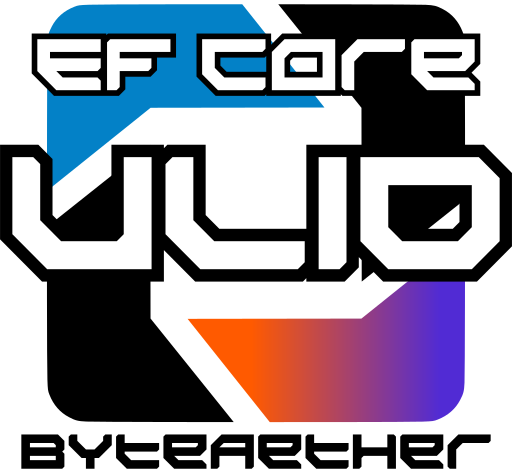
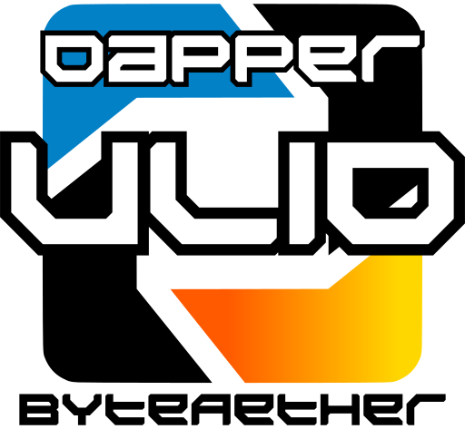

# 

[](https://github.com/ByteAether/Ulid/blob/main/LICENSE)
[](https://www.nuget.org/packages/ByteAether.Ulid/)
[](https://www.nuget.org/packages/ByteAether.Ulid/)
[](https://github.com/ByteAether/Ulid/actions/workflows/build-and-test.yml)
[](https://github.com/ByteAether/Ulid/actions/workflows/codeql.yml)

A high-performance, fully compliant .NET implementation of ULIDs (Universally Unique Lexicographically Sortable Identifiers), adhering to the [official ULID specification](https://github.com/ulid/spec).

## 📋 Table of Contents

- [Introduction](#-introduction)
- [Features](#-features)
- [Installation](#-installation)
- [Usage](#-usage)
- [API](#%EF%B8%8F-api)
- [Integration with Other Libraries](#-integration-with-other-libraries)
- [Benchmarking](#-benchmarking)
- [Prior Art](#%EF%B8%8F-prior-art)
- [Contributing](#-contributing)
- [License](#-license)

## 📖 Introduction

[](https://www.nuget.org/packages/ByteAether.Ulid/)

ULIDs (Universally Unique Lexicographically Sortable Identifiers) offer a modern, human-readable alternative to traditional GUIDs, optimized specifically for distributed systems and time-ordered data. **ByteAether.Ulid** delivers a high-performance, specification-compliant .NET implementation engineered to resolve critical concurrency and persistence edge cases left unaddressed by alternative libraries.

### Resilient Concurrency & Monotonic Overflow Handling

During high-throughput transaction bursts within the same millisecond, the 80-bit random component of a ULID can saturate. Traditional libraries respond to this saturation by throwing an `OverflowException` to protect strict timestamp boundaries. ByteAether.Ulid introduces a non-blocking alternative: when the 80-bit random segment saturates during a high-throughput burst within a single millisecond, it gracefully increments the millisecond timestamp component instead of throwing. This ensures uninterrupted ID generation under extreme local loads.

While this introduces a micro-scale timestamp adjustment localized strictly to the executing instance, the system clock catches up immediately once the burst subsides. The drift remains well within standard network latency boundaries and aligns with the workarounds in [ULID specification issue #39](https://github.com/ulid/spec/issues/39#issuecomment-2252145597).

### Mitigating Enumeration Attacks

Monotonic identifiers generated in rapid succession can expose predictable sequences, leaving systems vulnerable to enumeration attacks. This library mitigates this risk by supporting configurable random increments (ranging from 1 to 4 bytes) applied to the random component, as discussed in [ULID specification issue #105](https://github.com/ulid/spec/issues/105). This preserves strict lexicographical sortability while ensuring cryptographic unpredictability.

### ULID vs UUIDv7

While modern standards like UUIDv7 introduce timestamp-based sorting, [RFC 9562](https://www.rfc-editor.org/rfc/rfc9562#name-monotonicity-and-counters) treats sub-millisecond monotonicity as optional. [The native .NET UUIDv7 provider (`Guid.CreateVersion7`)](https://github.com/dotnet/runtime/blob/571b044582ceb7fe426b7f143c703064aa9ea4db/src/libraries/System.Private.CoreLib/src/System/Guid.cs#L306) uses random bits within the sub-millisecond payload rather than a strict sequential counter, sacrificing true chronological ordering under heavy bursts.

Furthermore, using .NET's native `Guid` structures for sequential IDs introduces severe endianness conflicts. Because `System.Guid` utilizes a legacy mixed-endian internal structure, most database providers serialize this raw memory layout directly to disk without modification. This scrambles the big-endian timestamp layout, completely breaking chronological index sorting. For engines with highly rigid index layouts like Microsoft SQL Server, time-first structures natively conflict with [custom `uniqueidentifier` indexing order](https://learn.microsoft.com/en-us/dotnet/api/system.data.sqltypes.sqlguid.compareto?view=net-10.0#remarks), triggering catastrophic page fragmentation.

**ByteAether.Ulid** corrects this by mandating big-endian, strict lexicographical sortability directly at the specification level. It features optimized storage strategies (`String`, `Binary`, `Guid`, and `SqlServerGuid`) across major ORMs to maintain perfect index allocations and deterministic sorting whether targeting PostgreSQL, MS SQL Server, MySQL, or SQLite.

## ✨ Features

This library explicitly **multi-targets** each runtime version listed below, enabling native optimizations, zero-allocation memory abstractions, and performance benefits tailored specifically to each target platform.


- **Universally Unique**: Ensures global uniqueness across systems.
- **Sortable**: Lexicographically ordered for time-based sorting.
- **Lock-Free Synchronization**: Monotonic generation utilizes a high-performance, **lock-free compare-and-exchange (CAS)** approach.
- **Specification-Compliant**: Fully adheres to the ULID specification.
- **Interoperable**: Includes conversion methods to and from GUIDs, [Crockford's Base32](https://www.crockford.com/base32.html) strings, and byte arrays.
- **Ahead-of-Time (AOT) Compilation**: Fully compatible with Native AOT for improved startup performance and smaller binary footprints.
- **Error-Free Generation**: Prevents `OverflowException` by incrementing the timestamp component when the random part overflows, ensuring continuous unique ULID generation.

### Extension Packages
* 📦 **[Entity Framework Core](#ef-core-integration--byteaetherulidentityframeworkcore)**
  `ByteAether.Ulid.EntityFrameworkCore`
* 📦 **[LinqToDB](#linqtodb-integration--byteaetherulidlinq2db)**
  `ByteAether.Ulid.linq2db`
* 📦 **[Dapper](#dapper-integration--byteaetheruliddapper)**
  `ByteAether.Ulid.Dapper`

These features collectively make **ByteAether.Ulid** a robust and efficient choice for managing unique identifiers in your .NET applications.

## 💾 Installation

Install the latest stable package via NuGet:
```sh
dotnet add package ByteAether.Ulid
```
To install a specific [preview version](https://www.nuget.org/packages/ByteAether.Ulid/absoluteLatest), use the `--version` option:
```sh
dotnet add package ByteAether.Ulid --version <VERSION_NUMBER>
```

## 🚀 Usage

Here is a basic example of how to use the ULID implementation:
```csharp
using System;
using ByteAether.Ulid;

// Create a new ULID
var ulid = Ulid.New();

// Convert to byte array and back
byte[] byteArray = ulid.ToByteArray();
var ulidFromByteArray = Ulid.New(byteArray);

// Convert to GUID and back
Guid guid = ulid.ToGuid();
var ulidFromGuid = Ulid.New(guid);

// Convert to string and back
string ulidString = ulid.ToString();
var ulidFromString = Ulid.Parse(ulidString);

Console.WriteLine($"ULID: {ulid}, GUID: {guid}, String: {ulidString}");
```

### Time-Range Filtering

Because ULIDs embed a millisecond-precision timestamp and maintain lexicographical order, you can use `Ulid.MinAt()` and `Ulid.MaxAt()` to generate boundary instances for specific time windows. This approach provides a uniform mechanism for range filtering across both in-memory collections and abstract data layers:

```csharp
// Define temporal boundaries for the target window
DateTimeOffset startTime = DateTimeOffset.UtcNow.AddDays(-7);
DateTimeOffset endTime = DateTimeOffset.UtcNow;

// Generate the minimum and maximum possible ULIDs for those precise timestamps
Ulid minBoundary = Ulid.MinAt(startTime);
Ulid maxBoundary = Ulid.MaxAt(endTime);

// Example 1: In-Memory Evaluation
var filteredItems = localItems
    .Where(item => item.Id >= minBoundary && item.Id <= maxBoundary);

// Example 2: Parameterized Data Store Constraint
var query = "SELECT * FROM Records WHERE Id >= @Min AND Id <= @Max";
```

> [!IMPORTANT]
> **Database Persistence Considerations**
> 
> While range evaluations remain consistent across in-memory object graphs, executing these queries against a relational data store introduces critical persistence dependencies:
> * **Storage Format & Byte Order**: Certain database engines and native UUID data types utilize mixed-endian byte layouts. If a ULID is persisted using a strategy that reorders its raw big-endian bytes, chronological sorting behavior will diverge between the application and the database server.
> * **Index & Query Integrity**: Mismatches between the database engine's native sorting rules and the chosen storage format can result in broken data retrieval, bypassed indexes, or incorrect query results during database-side range operations (`>=`, `<=`) and `ORDER BY` execution.
>
>
> **Recommendation**: Before implementing database-side time-range queries, ensure your chosen storage format (e.g., String, Binary, or provider-specific Guid) aligns with your target database engine's native indexing and evaluation mechanics.

### Advanced Generation

You can customize ULID generation by providing `GenerationOptions`. This allows you to control monotonicity and the source of randomness.

#### Example: Monotonic ULID with Random Increments

To generate ULIDs that are monotonically increasing with a random increment, you can specify the `Monotonicity` option.
```csharp
using System;
using ByteAether.Ulid;
using static ByteAether.Ulid.Ulid.GenerationOptions;

// Configure options for a 2-byte random increment
var options = new Ulid.GenerationOptions
{
	Monotonicity = MonotonicityOptions.MonotonicRandom2Byte
};

// Generate a ULID with the specified options
var ulid = Ulid.New(options);

Console.WriteLine($"ULID with random increment: {ulid}");
```
#### Example: Setting Default Generation Options

You can set default generation options for the entire application. This is useful for consistently applying specific behaviors, such as prioritizing performance over cryptographic security.
```csharp
using System;
using ByteAether.Ulid;
using static ByteAether.Ulid.Ulid.GenerationOptions;

// Set default generation options for the entire application
Ulid.DefaultGenerationOptions = new()
{
	Monotonicity = MonotonicityOptions.MonotonicIncrement,
	InitialRandomSource = new PseudoRandomProvider(),
	IncrementRandomSource = new PseudoRandomProvider()
};

// Now, any subsequent call to Ulid.New() will use these options
var ulid = Ulid.New();

Console.WriteLine($"ULID from pseudo-random source: {ulid}");
```

## ⚙️ API

The `Ulid` implementation provides the following properties and methods:

### Creation

- `Ulid.New(GenerationOptions? options = null)`\
  Generates a new ULID using default generation options. Accepts an optional `GenerationOptions` parameter to customize the generation behavior.
- `Ulid.New(DateTimeOffset dateTimeOffset, GenerationOptions? options = null)`\
  Generates a new ULID using the specified `DateTimeOffset` and default generation options. Accepts an optional `GenerationOptions` parameter to customize the generation behavior.
- `Ulid.New(long timestamp, GenerationOptions? options = null)`\
  Generates a new ULID using the specified Unix timestamp in milliseconds (`long`) and default generation options. Accepts an optional `GenerationOptions` parameter to customize the generation behavior.
- `Ulid.New(DateTimeOffset dateTimeOffset, ReadOnlySpan<byte> random)`\
  Generates a new ULID using the specified `DateTimeOffset` and a pre-existing random byte array.
- `Ulid.New(long timestamp, ReadOnlySpan<byte> random)`\
  Generates a new ULID using the specified Unix timestamp in milliseconds (`long`) and a pre-existing random byte array.
- `Ulid.New(ReadOnlySpan<byte> bytes)`\
  Creates a ULID from an existing byte array.
- `Ulid.New(Guid guid)`\
  Creates a ULID from an existing `Guid`.
- `Ulid.MinAt(DateTimeOffset datetime)`\
  Creates the minimum possible ULID value for the specified `DateTimeOffset`.
- `Ulid.MinAt(long timestamp)`\
  Creates the minimum possible ULID value for the specified Unix timestamp in milliseconds (`long`).
- `Ulid.MaxAt(DateTimeOffset datetime)`\
  Creates the maximum possible ULID value for the specified `DateTimeOffset`.
- `Ulid.MaxAt(long timestamp)`\
  Creates the maximum possible ULID value for the specified Unix timestamp in milliseconds (`long`).

### Checking Validity

- `Ulid.IsValid(string ulidString)`\
  Validates whether the specified string represents a valid ULID.
- `Ulid.IsValid(ReadOnlySpan<char> ulidString)`\
  Validates whether the specified span of characters represents a valid ULID.
- `Ulid.IsValid(ReadOnlySpan<byte> ulidBytes)`\
  Validates whether the specified byte array represents a valid ULID.

### Parsing

- `Ulid.Parse(ReadOnlySpan<char> chars, IFormatProvider? provider = null)`\
  Parses a ULID from a character span in canonical format. The `IFormatProvider` is ignored.
- `Ulid.TryParse(ReadOnlySpan<char> s, IFormatProvider? provider, out Ulid result)`\
  Tries to parse a ULID from a character span in canonical format. Returns `true` if successful.
- `Ulid.Parse(string s, IFormatProvider? provider = null)`\
  Parses a ULID from a string in canonical format. The `IFormatProvider` is ignored.
- `Ulid.TryParse(string? s, IFormatProvider? provider, out Ulid result)`\
  Tries to parse a ULID from a string in canonical format. Returns `true` if successful.

### Properties

- `Ulid.MinValue`\
  Represents an empty ULID, equivalent to `default(Ulid)` and `Ulid.New(new byte[16])`.
- `Ulid.MaxValue`\
  Represents the maximum possible value for a ULID (all bytes set to `0xFF`).
- `Ulid.Empty`\
  Alias for `Ulid.MinValue`.
- `Ulid.DefaultGenerationOptions`\
  Default configuration for ULID generation when no options are provided by the `Ulid.New(...)` call.
- `.Time`\
  Gets the timestamp component of the ULID as a `DateTimeOffset`.
- `.TimeBytes`\
  Gets the timestamp component of the ULID as a `ReadOnlySpan<byte>`.
- `.Random`\
  Gets the random component of the ULID as a `ReadOnlySpan<byte>`.

### Conversions & Interoperability

- `.AsByteSpan()`\
  Provides a `ReadOnlySpan<byte>` representing the contents of the ULID.
- `.ToByteArray()`\
  Converts the ULID to a byte array.
- `.ToGuid()`\
  Converts the ULID to a `Guid`.
- `.ToString(string? format = null, IFormatProvider? formatProvider = null)`\
  Converts the ULID to a canonical string representation. Format arguments are ignored.
- Provides implicit operators to and from `Guid` and `string`.

### Comparison Operators & .NET Interfaces

- Supports all comparison operators:\
  `==`, `!=`, `<`, `<=`, `>`, `>=`.
- Implements standard comparison and equality methods:\
  `CompareTo`, `Equals`, `GetHashCode`.
- Implements the following .NET standard interfaces:\
  `IMinMaxValue<Ulid>`, `IEquatable<Ulid>`, `IEqualityComparer<Ulid>`, `IComparable`, `IComparable<Ulid>`, `IComparisonOperators<Ulid, Ulid, bool>`, `IFormattable`, `IParsable<Ulid>`, `ISpanFormattable`, `ISpanParsable<Ulid>`, `IUtf8SpanFormattable`, `IUtf8SpanParsable<Ulid>`.

### GenerationOptions

The `GenerationOptions` class provides detailed configuration for ULID generation, with the following key properties:

- `Monotonicity`\
  Controls the behavior of ULID generation when multiple identifiers are created within the same millisecond. It determines whether ULIDs are strictly increasing or allow for random ordering within that millisecond. Available options include: `NonMonotonic`, `MonotonicIncrement` (default), `MonotonicRandom1Byte`, `MonotonicRandom2Byte`, `MonotonicRandom3Byte`, `MonotonicRandom4Byte`.

- `InitialRandomSource`\
  An `IRandomProvider` for generating the random bytes of a ULID. The default `CryptographicallySecureRandomProvider` ensures robust, unpredictable ULIDs using a cryptographically secure generator.

- `IncrementRandomSource`\
  An `IRandomProvider` that provides randomness for monotonic random increments. The default `PseudoRandomProvider` is a faster, non-cryptographically secure source optimized for this specific purpose.

This library comes with two default `IRandomProvider` implementations:

- **`CryptographicallySecureRandomProvider`**\
  Utilizes `System.Security.Cryptography.RandomNumberGenerator` for high-quality, cryptographically secure random data.
- **`PseudoRandomProvider`**\
  A faster, non-cryptographically secure option based on `System.Random`, ideal for performance-critical scenarios where cryptographic security is not required for random increments.

Custom `IRandomProvider` implementations can also be created.

## 🔌 Integration with Other Libraries

### ASP.NET Core

Supports seamless integration as a route or query parameter with built-in `TypeConverter`.

### System.Text.Json (.NET 5.0+)

Includes a `JsonConverter` for easy serialization and deserialization.

### [EF Core](https://github.com/dotnet/efcore) Integration – ByteAether.Ulid.EntityFrameworkCore

[](https://www.nuget.org/packages/ByteAether.Ulid.EntityFrameworkCore/)

[](https://github.com/ByteAether/Ulid/blob/main/LICENSE)

[](https://www.nuget.org/packages/ByteAether.Ulid.EntityFrameworkCore/)
[](https://www.nuget.org/packages/ByteAether.Ulid.EntityFrameworkCore/)


To seamlessly use ULIDs with [Entity Framework Core](https://github.com/dotnet/efcore), install the specialized extension package:

```sh
dotnet add package ByteAether.Ulid.EntityFrameworkCore
```

Register the ULID conventions within your `DbContext` via the `ConfigureConventions` method. You can choose from various underlying storage strategies (`String`, `Binary`, `Guid`, or `SqlServerGuid`):

```csharp
using ByteAether.Ulid.EntityFrameworkCore;

protected override void ConfigureConventions(ModelConfigurationBuilder configurationBuilder)
{
    // Registers mapping for both Ulid and Ulid? types.
    // Supports: UlidStorageFormat.String (Default), Binary, Guid, and SqlServerGuid
    configurationBuilder
        .RegisterUlid(UlidStorageFormat.Binary);
}
```
#### Per-Property Mapping (Fine-Grained Control)
If you need different storage formats for different tables or columns, bypass global conventions and configure specific `ValueConverter` classes directly on individual properties via `OnModelCreating`:

```csharp
using ByteAether.Ulid.EntityFrameworkCore;

protected override void OnModelCreating(ModelBuilder modelBuilder)
{
    // Store this specific ULID as a 26-character String
    modelBuilder.Entity<User>()
      .Property(u => u.Id)
      .HasConversion<UlidToStringConverter>();

    // Store this specific ULID as a 16-byte Binary array
    modelBuilder.Entity<Order>()
        .Property(o => o.Id)
        .HasConversion<UlidToBytesConverter>();

    // Store this specific ULID as a standard Native GUID
    modelBuilder.Entity<Product>()
        .Property(p => p.Id)
        .HasConversion<UlidToGuidConverter>();

    // Store this specific ULID optimized for MSSQL uniqueidentifier index sorting
    modelBuilder.Entity<LogEntry>()
        .Property(l => l.Id)
        .HasConversion<UlidToSqlServerGuidConverter>();
}
```

More details in the package's [PACKAGE.md](./src/EFCore/PACKAGE.md) file.

### [LinqToDB](https://github.com/linq2db/linq2db) Integration – ByteAether.Ulid.linq2db

[](https://www.nuget.org/packages/ByteAether.Ulid.linq2db/)

[](https://github.com/ByteAether/Ulid/blob/main/LICENSE)

[](https://www.nuget.org/packages/ByteAether.Ulid.linq2db/)
[](https://www.nuget.org/packages/ByteAether.Ulid.linq2db/)


To integrate with [LinqToDB](https://github.com/linq2db/linq2db), install the specialized extension package:

```sh
dotnet add package ByteAether.Ulid.linq2db
```

Register the ULID conventions for your `DataOptions` instance using your preferred storage backend format (`String`, `Binary`, `Guid`, or `SqlServerGuid`):

```csharp
using LinqToDB;
using ByteAether.Ulid.LinqToDB;

var options = new DataOptions()
    .UseSQLite()
    .UseConnectionString(connectionString)
    // Registers mapping for both Ulid and Ulid? types.
    // Supports: UlidStorageFormat.String (Default), Binary, Guid, and SqlServerGuid
    .RegisterUlid(UlidStorageFormat.Binary);
```

More details in the package's [PACKAGE.md](./src/LinqToDB/PACKAGE.md) file.

### [Dapper](https://github.com/DapperLib/Dapper) Integration – ByteAether.Ulid.Dapper

[](https://www.nuget.org/packages/ByteAether.Ulid.Dapper/)

[](https://github.com/ByteAether/Ulid/blob/main/LICENSE)

[](https://www.nuget.org/packages/ByteAether.Ulid.Dapper/)
[](https://www.nuget.org/packages/ByteAether.Ulid.Dapper/)


To integrate with [Dapper](https://github.com/DapperLib/Dapper), install the specialized extension package:

```sh
dotnet add package ByteAether.Ulid.Dapper
```

Call `DapperUlid.RegisterUlid()` during application startup (e.g., in `Program.cs`) before executing database queries. You can choose from various underlying storage formats (`String`, `Binary`, `Guid`, or `SqlServerGuid`):

```csharp
using ByteAether.Ulid.Dapper;

// Registers the mapping globally for both Ulid and Ulid? types.
// Supports: UlidStorageFormat.String (Default), Binary, Guid, and SqlServerGuid
DapperUlid.RegisterUlid(UlidStorageFormat.Binary);
```

> [!NOTE]
> Dapper maps .NET types globally using a 1:1 scheme (`Type` → `TypeHandler`). A single global storage strategy must be selected for the entire application lifecycle. Mixing formats (e.g., `String` and `Binary`) across distinct tables within the same process instance is not supported.

More details in the package's [PACKAGE.md](./src/Dapper/PACKAGE.md) file.

### Newtonsoft.Json Integration

To use ULIDs with **Newtonsoft.Json**, you need to create a custom **JsonConverter** to handle the serialization and deserialization of ULID values. Here's how to set it up:

#### 1. Create the Custom JsonConverter

First, create a custom `JsonConverter<Ulid>` for `Ulid` to handle string serialization and deserialization:
```csharp
using Newtonsoft.Json;
using System;

public class UlidJsonConverter : JsonConverter<Ulid>
{
    public override Ulid ReadJson(
        JsonReader reader,
        Type objectType,
        Ulid existingValue,
        bool hasExistingValue,
        JsonSerializer serializer
    )
    {
        var value = (string)reader.Value;
        return Ulid.Parse(value);
    }
  
    public override void WriteJson(
        JsonWriter writer,
        Ulid value,
        JsonSerializer serializer
    )
    {
        writer.WriteValue(value.ToString());
    }
}
```
#### 2. Register the JsonConverter

Once the `UlidJsonConverter` is created, you need to register it with **Newtonsoft.Json** to handle `Ulid` serialization and deserialization. You can register the converter globally when configuring your JSON settings:
```csharp
using Newtonsoft.Json;
using System.Collections.Generic;

JsonConvert.DefaultSettings = () => new JsonSerializerSettings
{
    Converters = new List<JsonConverter> { new UlidJsonConverter() }
};
```
Alternatively, you can specify the converter explicitly in individual serialization or deserialization calls:
```csharp
var settings = new JsonSerializerSettings();
settings.Converters.Add(new UlidJsonConverter());

var json = JsonConvert.SerializeObject(myObject, settings);
var deserializedObject = JsonConvert.DeserializeObject<MyObject>(json, settings);
```

### MessagePack Integration
To use ULIDs with **MessagePack**, you can create a custom **MessagePackResolver** to handle the serialization and deserialization of `Ulid` as `byte[]`. Here's how to set it up:

#### 1. Create the Custom Formatter

First, create a custom formatter for `Ulid` to handle its conversion to and from `byte[]`:
```csharp
using MessagePack;
using MessagePack.Formatters;

public class UlidFormatter : IMessagePackFormatter<Ulid>
{
	public Ulid Deserialize(
        ref MessagePackReader reader,
        MessagePackSerializerOptions options
    )
	{
		var bytes = reader.ReadByteArray();
		return Ulid.New(bytes);
	}

	public void Serialize(
        ref MessagePackWriter writer,
        Ulid value, MessagePackSerializerOptions options
    )
	{
		writer.Write(value.ToByteArray());
	}
}
```
#### 2. Register the Formatter

Once the `UlidFormatter` is created, you need to register it with the `MessagePackSerializer` to handle the `Ulid` type.
```csharp
MessagePack.Resolvers.CompositeResolver.Register(
	new IMessagePackFormatter[] { new UlidFormatter() },
	MessagePack.Resolvers.StandardResolver.GetFormatterWithVerify<Ulid>()
);
```
Alternatively, you can register the formatter globally when configuring MessagePack options:
```csharp
MessagePackSerializer.DefaultOptions = MessagePackSerializer.DefaultOptions
	.WithResolver(MessagePack.Resolvers.CompositeResolver.Create(
		new IMessagePackFormatter[] { new UlidFormatter() },
		MessagePack.Resolvers.StandardResolver.Instance
	));
```

## 📊 Benchmarking

Benchmarking was performed using [BenchmarkDotNet](https://github.com/dotnet/BenchmarkDotNet) to demonstrate the performance and efficiency of this ULID implementation. Comparisons include [NetUlid](https://github.com/ultimicro/netulid) 2.1.0, [Ulid](https://github.com/Cysharp/Ulid) 1.4.1, [NUlid](https://github.com/RobThree/NUlid) 1.7.3, and `Guid` for overlapping functionalities like creation, parsing, and byte conversions.

### Configuration Reference

* **`ByteAetherUlid`**: Standard generation using cryptographically secure defaults.
* **`ByteAetherUlidR1Bc` / `ByteAetherUlidR4Bc`**: Monotonic generation with a cryptographically secure random increment (1-byte / 4-byte).
* **`ByteAetherUlidR1Bp` / `ByteAetherUlidR4Bp`**: Monotonic generation optimized with a pseudo-random increment (1-byte / 4-byte).
* **`ByteAetherUlidP`**: Non-monotonic generation using a high-performance pseudo-random provider.

The following benchmarks were performed:
```
BenchmarkDotNet v0.15.8, Windows 10 (10.0.19044.7417/21H2/November2021Update)
AMD Ryzen 7 3700X 3.60GHz, 1 CPU, 8 logical and 4 physical cores
.NET SDK 10.0.301
  [Host]     : .NET 10.0.9 (10.0.9, 10.0.926.27113), X64 RyuJIT x86-64-v3
  DefaultJob : .NET 10.0.9 (10.0.9, 10.0.926.27113), X64 RyuJIT x86-64-v3

Job=DefaultJob

| Type            | Method             | Mean        | Error     | Gen0   | Allocated |
|---------------- |------------------- |------------:|----------:|-------:|----------:|
| Generate        | ByteAetherUlid     |  40.5719 ns | 0.6657 ns |      - |         - |
| Generate        | ByteAetherUlidR1Bp |  48.3766 ns | 0.1168 ns |      - |         - |
| Generate        | ByteAetherUlidR4Bp |  49.9384 ns | 0.0914 ns |      - |         - |
| Generate        | ByteAetherUlidR1Bc |  89.6066 ns | 0.6575 ns |      - |         - |
| Generate        | ByteAetherUlidR4Bc |  91.5831 ns | 0.3683 ns |      - |         - |
| Generate        | NetUlid *(1)       | 162.1996 ns | 0.7979 ns | 0.0095 |      80 B |
| Generate        | NUlid *(2)         |  49.6330 ns | 0.1247 ns |      - |         - |

| GenerateNonMono | ByteAetherUlid     |  89.6904 ns | 0.5098 ns |      - |         - |
| GenerateNonMono | ByteAetherUlidP    |  40.9386 ns | 0.1507 ns |      - |         - |
| GenerateNonMono | Ulid *(3,4)        |  39.5954 ns | 0.0592 ns |      - |         - |
| GenerateNonMono | NUlid              |  93.1371 ns | 0.4716 ns |      - |         - |
| GenerateNonMono | Guid *(5)          |  47.6369 ns | 0.1340 ns |      - |         - |
| GenerateNonMono | GuidV7 *(3,5)      |  78.6568 ns | 0.4788 ns |      - |         - |

| FromByteArray   | ByteAetherUlid     |   0.7974 ns | 0.0076 ns |      - |         - |
| FromByteArray   | NetUlid            |   1.4321 ns | 0.0109 ns |      - |         - |
| FromByteArray   | Ulid               |   1.1894 ns | 0.0115 ns |      - |         - |
| FromByteArray   | NUlid              |   1.1603 ns | 0.0105 ns |      - |         - |
| FromByteArray   | Guid               |   1.0478 ns | 0.0084 ns |      - |         - |

| FromGuid        | ByteAetherUlid     |   0.8286 ns | 0.0052 ns |      - |         - |
| FromGuid        | NetUlid            |   2.5073 ns | 0.1470 ns |      - |         - |
| FromGuid        | Ulid               |   2.3504 ns | 0.0776 ns |      - |         - |
| FromGuid        | NUlid              |   0.9781 ns | 0.0437 ns |      - |         - |

| FromString      | ByteAetherUlid     |  15.2724 ns | 0.2616 ns |      - |         - |
| FromString      | NetUlid            |  28.4821 ns | 0.5618 ns |      - |         - |
| FromString      | Ulid               |  17.8202 ns | 0.2157 ns |      - |         - |
| FromString      | NUlid              |  64.0466 ns | 1.4103 ns | 0.0086 |      72 B |
| FromString      | Guid               |  22.5952 ns | 0.4522 ns |      - |         - |

| ToByteArray     | ByteAetherUlid     |   4.6165 ns | 0.1121 ns | 0.0048 |      40 B |
| ToByteArray     | AsByteSpan *(6)    |   0.7794 ns | 0.0064 ns |      - |         - |
| ToByteArray     | NetUlid            |   9.4252 ns | 0.0894 ns | 0.0048 |      40 B |
| ToByteArray     | Ulid               |   4.5432 ns | 0.0997 ns | 0.0048 |      40 B |
| ToByteArray     | NUlid              |   8.5760 ns | 0.1168 ns | 0.0048 |      40 B |

| ToGuid          | ByteAetherUlid     |   0.8083 ns | 0.0102 ns |      - |         - |
| ToGuid          | NetUlid            |  10.4080 ns | 0.0285 ns |      - |         - |
| ToGuid          | Ulid               |   1.2320 ns | 0.0102 ns |      - |         - |
| ToGuid          | NUlid              |   0.7692 ns | 0.0057 ns |      - |         - |

| ToString        | ByteAetherUlid     |  19.1190 ns | 0.2176 ns | 0.0095 |      80 B |
| ToString        | NetUlid            |  23.7245 ns | 0.1987 ns | 0.0095 |      80 B |
| ToString        | Ulid               |  19.8952 ns | 0.2056 ns | 0.0095 |      80 B |
| ToString        | NUlid              |  29.1001 ns | 0.1223 ns | 0.0095 |      80 B |
| ToString        | Guid               |   7.9173 ns | 0.0257 ns | 0.0115 |      96 B |

| CompareTo       | ByteAetherUlid     |   1.3642 ns | 0.0089 ns |      - |         - |
| CompareTo       | NetUlid            |   4.7076 ns | 0.0190 ns |      - |         - |
| CompareTo       | Ulid               |   6.7843 ns | 0.0188 ns |      - |         - |
| CompareTo       | NUlid              |   9.1551 ns | 0.0284 ns |      - |         - |
| CompareTo       | Guid               |   4.7391 ns | 0.0188 ns |      - |         - |

| Equals          | ByteAetherUlid     |   1.1228 ns | 0.0164 ns |      - |         - |
| Equals          | NetUlid            |   1.9661 ns | 0.0091 ns |      - |         - |
| Equals          | Ulid               |   1.1092 ns | 0.0156 ns |      - |         - |
| Equals          | NUlid              |   1.0888 ns | 0.0063 ns |      - |         - |
| Equals          | Guid               |   1.0827 ns | 0.0085 ns |      - |         - |

| GetHashCode     | ByteAetherUlid     |   0.9166 ns | 0.0046 ns |      - |         - |
| GetHashCode     | NetUlid            |   8.9307 ns | 0.0230 ns |      - |         - |
| GetHashCode     | Ulid               |   0.9288 ns | 0.0083 ns |      - |         - |
| GetHashCode     | NUlid              |   7.0085 ns | 0.0312 ns |      - |         - |
| GetHashCode     | Guid               |   0.9337 ns | 0.0068 ns |      - |         - |
```

Alternative .NET ecosystem solutions exhibit design constraints or spec deviations under heavy production loads:

1. `NetUlid`: Monotonicity guarantees are thread-confined and fail across concurrent multi-threaded execution loops.
2. `NUlid`: Although it provides a monotonic random provider (`MonotonicUlidRng`), it lacks out-of-the-box global state management. Developers must manually instantiate and persist the generator instance, requiring custom wrappers to maintain thread-safe monotonicity across call sites.
3. `Ulid` (Cysharp) & `GuidV7`: Do not implement monotonicity.
4. `Ulid` (Cysharp): Relies on a cryptographically insecure `XOR-Shift64` algorithm for sequence generation after seeding.
5. Native `Guid` / `GuidV7`: [Microsoft documentation explicitly warns](https://learn.microsoft.com/en-us/dotnet/api/system.guid.newguid?view=net-9.0#remarks) that the underlying RNG is not guaranteed to be cryptographically secure, rendering them unsuitable for security-sensitive unique keys.
6. `AsByteSpan`: A zero-allocation performance optimization unique to `ByteAether.Ulid`, exposing a direct `ReadOnlySpan<byte>` slice of the underlying structure.

Furthermore, both `NetUlid` and `NUlid`, despite offering monotonicity, are susceptible to `OverflowException` due to random-part overflow.

This implementation demonstrates performance comparable to or exceeding its closest competitors. Crucially, it provides the most complete adherence to the official ULID specification, ensuring superior reliability and robustness for your applications compared to other libraries.

## 🏛️ Prior Art

Much of this implementation is either based on or inspired by existing works. This library is standing on the shoulders of giants.

* [NetUlid](https://github.com/ultimicro/netulid)
* [Ulid](https://github.com/Cysharp/Ulid)
* [NUlid](https://github.com/RobThree/NUlid)
* [Official ULID specification](https://github.com/ulid/spec)
* [Crockford's Base32](https://www.crockford.com/base32.html)

## 🤝 Contributing

We welcome all contributions! You can:

* **Open a Pull Request:** Fork the repository, create a branch, make your changes, and submit a pull request to the `main` branch.
* **Report Issues:** Found a bug or have a suggestion? [Open an issue](https://github.com/ByteAether/Ulid/issues) with details.

Thank you for helping improve the project!

## 📜 License

This project is licensed under the MIT License. See the [LICENSE](LICENSE) file for details.
